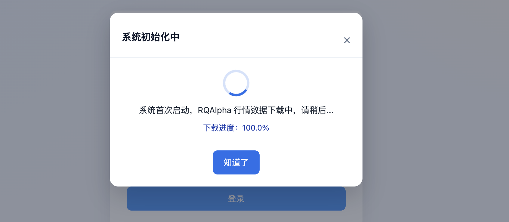
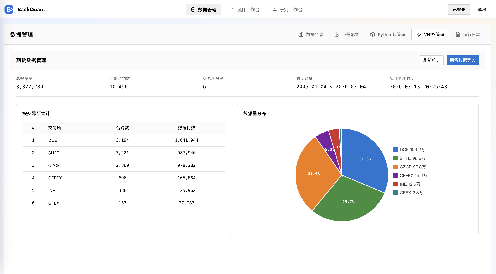
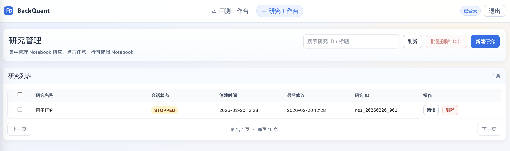

# BackQuant 量化回测平台

本仓库包含后端（Flask + RQAlpha）与前端（Vue 3）两部分，并提供 Research 工作台（Jupyter Lab）集成能力。
**推荐使用 Docker 安装部署**，一次性包含 Flask、Jupyter、Nginx 与前端构建产物，目标是镜像拉下来就能跑。

## 一、Docker 安装与部署

### 安装 Docker

```bash
sudo curl -fsSL https://get.docker.com | sh
```

### 安装前注意事项

1. **RQAlpha 行情数据时间范围为 200501 至 202602**，压缩包约 1G，下载解压耗时较长。
2. **Docker 构建完成后需等待行情下载完成才能登录**。
3. **系统运行请至少准备 5G 硬盘空间**。

### 安装与启动（Docker Compose）

Docker Compose 默认使用 named volume 持久化 RQAlpha bundle（`rqalpha_bundle`）。下载逻辑在容器 entrypoint 内完成：
首次启动会下载到 `/data/rqalpha/bundle`，之后复用同一 volume，不会重复下载。

```bash
cp .env.example .env
docker compose up --build -d
```

### RQAlpha 与日线数据

- Docker 镜像已内置 RQAlpha（`rqalpha==6.1.2`）。
- 镜像已预装常用量化库：`numpy`、`pandas`、`statsmodels`、`scikit-learn`（`datetime`、`math` 为 Python 标准库无需安装）。
- 内置一个默认策略 `demo`，可直接在策略列表中运行。
- 日线数据按月更新：容器启动时自动写入 crontab（`/etc/cron.d/rqalpha-bundle`，默认每月 1 日 03:00 运行更新任务）。
- 如需调整更新时间，设置环境变量 `RQALPHA_BUNDLE_CRON`（例如 `0 4 1 * *`）。
- 如需关闭自动更新，设置 `RQALPHA_BUNDLE_CRON=off`。
- 如需跳过首次下载，设置 `RQALPHA_BUNDLE_BOOTSTRAP=0`（仅建议已手动准备好 bundle 时使用）。

### 访问

- 前端：`http://localhost:8088`
- 首次登录账号/密码：`admin` / `pass123456`（可在 `.env` 中修改）

说明：后端 API 与 Jupyter 已通过同域路径反向代理（`/api`、`/jupyter`），一般无需单独访问端口。

### 系统截图





## 二、配置说明

后端主要配置在 `backtest/.env.wsgi`：

- `SECRET_KEY` JWT 签名密钥，必须修改
- `LOCAL_AUTH_MOBILE` / `LOCAL_AUTH_PASSWORD` 默认管理员用户名/密码（首次初始化写入数据库）
- `LOCAL_AUTH_PASSWORD_HASH` 可选，bcrypt hash 优先级高于明文密码
- `AUTH_DB_PATH` 可选，认证数据库路径（默认 `<BACKTEST_BASE_DIR>/auth.sqlite3`）
- `RESEARCH_NOTEBOOK_*` Jupyter 相关配置
- 说明：Jupyter token 可不设置（空值表示不启用 token 鉴权，仅建议用于内网/本机）。

前端支持两种方式配置 API 基址：

- 构建时环境变量 `VUE_APP_API_BASE`
- 运行时 `frontend/public/config.js`（无需重新构建）

## 三、其他的

### Jupyter 示例

- 示例 Notebook：`docs/notebooks/example.ipynb`
- 详细说明：`docs/jupyter.md`

### Nginx 反代说明

生产环境可参考 `docs/nginx.md`。

### API 文档

后端 API 说明见 `backtest/README.md`。

### License

Apache-2.0. See `LICENSE`.

### 微信公众号

欢迎关注我的微信公众号：ETF量化老司机
